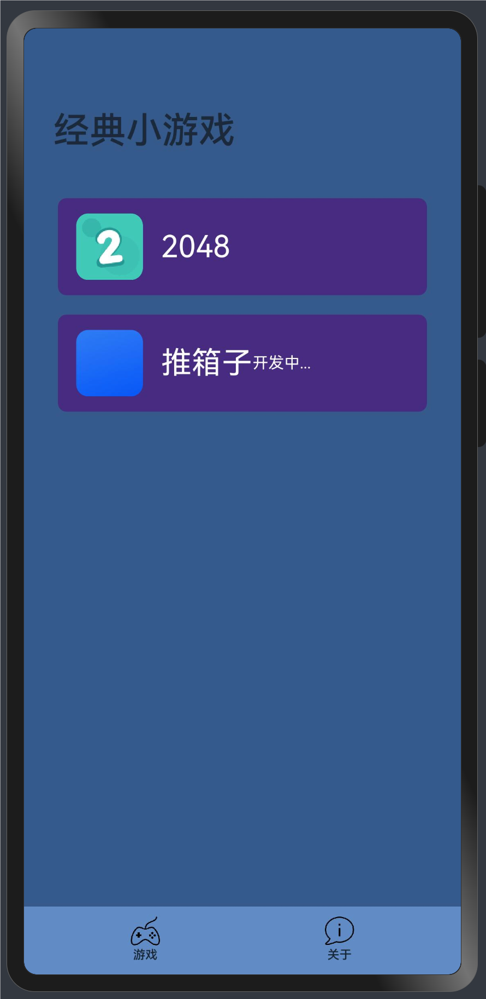
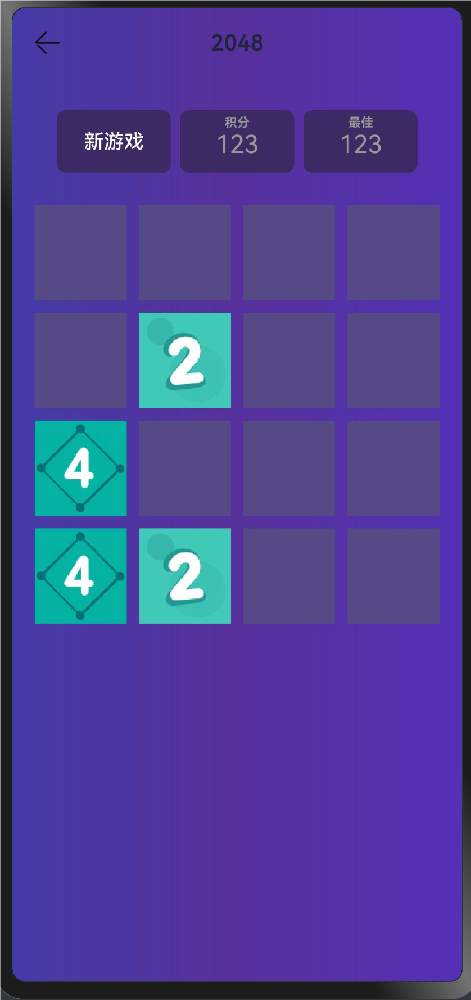

# HarmonyOS

## About
基于[华为鸿蒙](https://developer.huawei.com/consumer/cn/sdk) HarmonyOS SDK ，ArkTS 开发的小游戏，学习鸿蒙开发。

## Install

1. 请[安装最新版DevEco Studio](https://developer.huawei.com/consumer/cn/download/)。
1. `git clone https://gitee.com/dividi_z/harmonyos-games.git`
1. Open this Project

## Feature
- [x] 2048 **开发完善中**
- [ ] 推箱子
- [ ] 贪吃蛇
- [ ] more

## Contribute

欢迎提交 PR

## Games

### 2048

## Authors

- [@Jim](https://gitee.com/dividi_z)

## License

[MIT](https://choosealicense.com/licenses/mit/)

